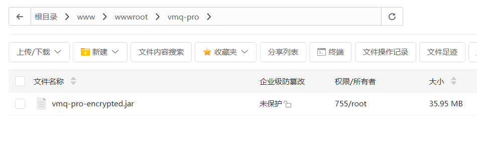
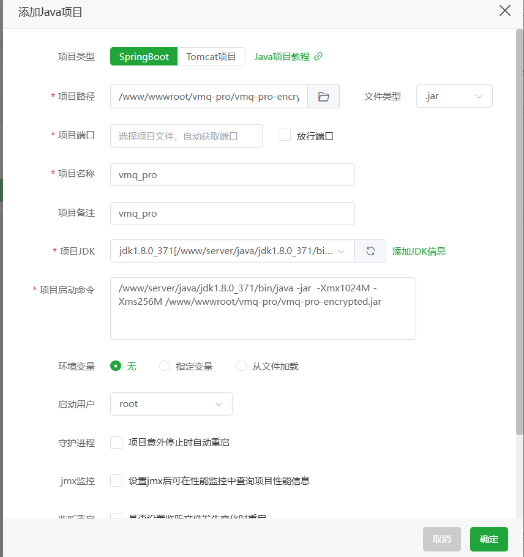
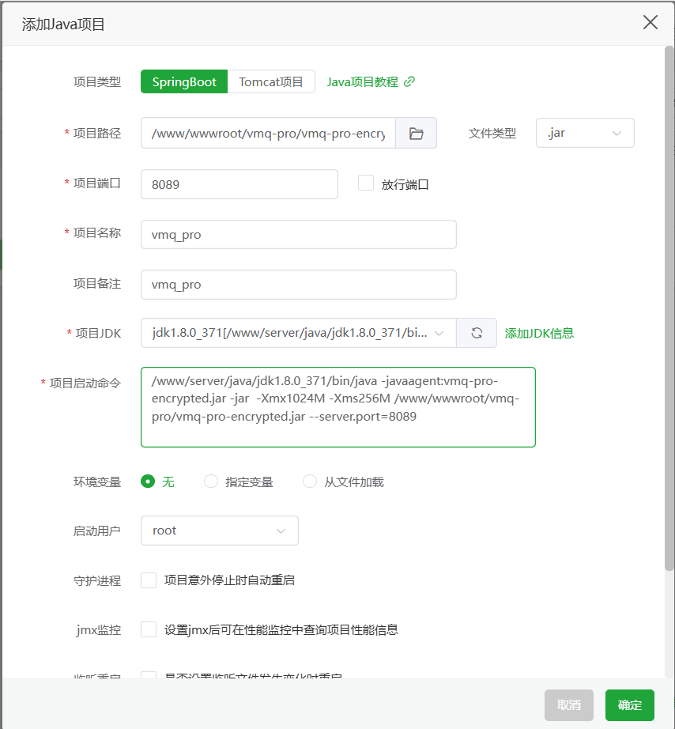
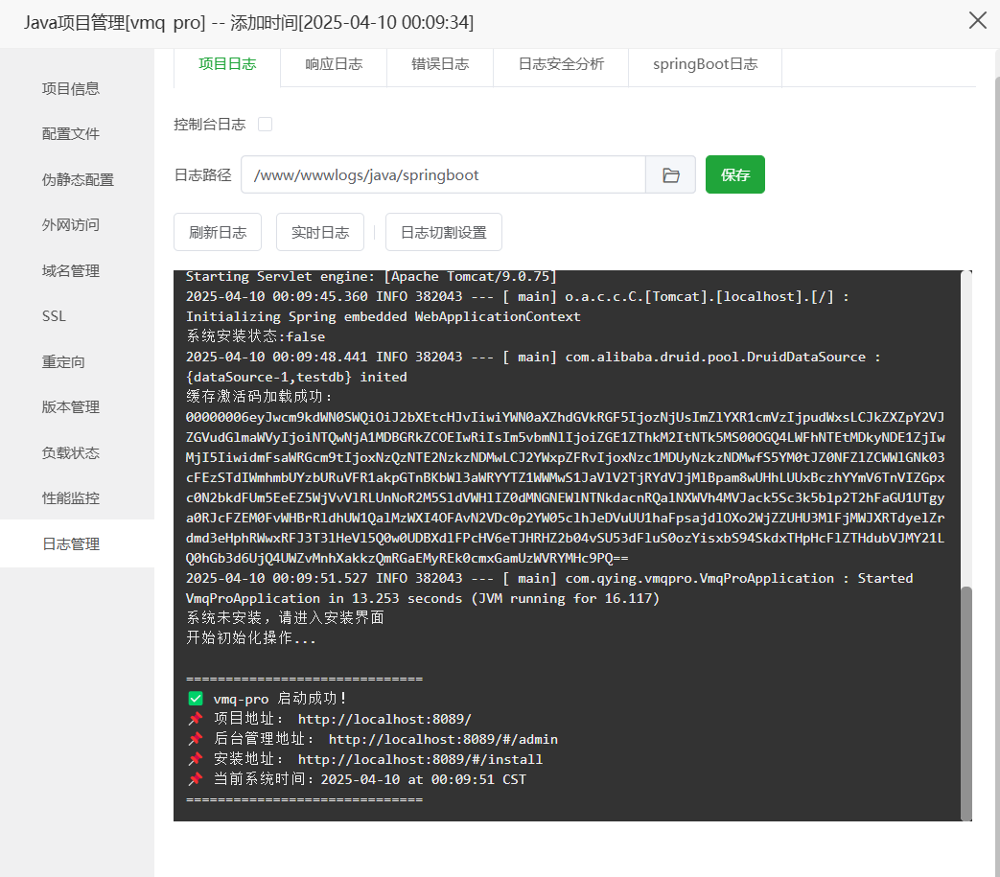
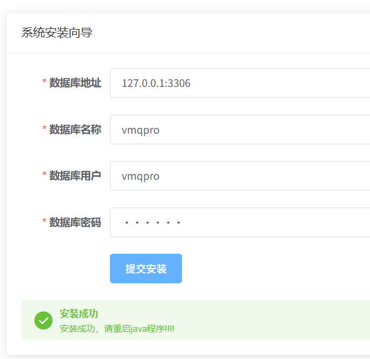
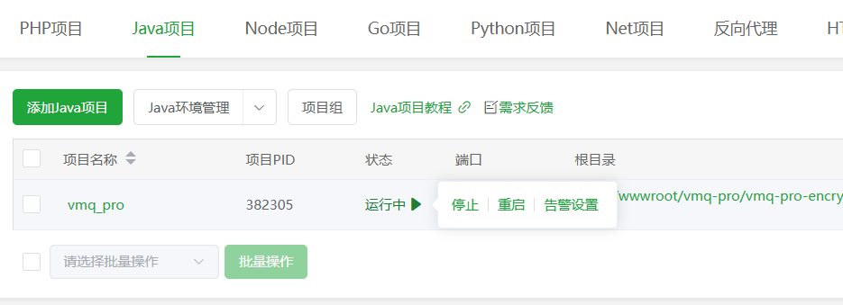

# BT 软件安装指南

本指南详细描述了 BT 软件的安装流程。请按照以下步骤依次操作，确保环境与依赖项均已满足要求。

## 前提条件

- **Java 开发环境**：确保系统已安装 JDK 1.8。
- **文件准备**：确保已获取 BT 软件的 jar 包及 **vmq-pro-encrypted.jar** 文件。
- **数据库信息**：准备好数据库的连接信息（包括数据库地址、端口、用户名、密码等）。
- **服务器环境**：确保服务器具备运行 Java 项目的条件。

## 安装步骤

### 1. 上传 Jar 包与创建文件夹

- **操作说明**：
  
  - 在服务器上创建一个用于存放 vmq-pro项目的文件夹。
  - 将 vmq-pro项目的 jar 包上传到该文件夹中。
  
- **参考截图**：

  

### 2. 添加 Java 项目

- **操作说明**：
  - 在开发环境中创建一个新的 Java 项目。
  - 使用 JDK 1.8 创建项目以保证版本兼容。
  
- **参考截图**：

  

### 3. 修改启动命令

- **操作说明**：
  
  - 定位启动命令文件，找到原始命令 `java -jar`。
  - 在 `java` 与 `-jar` 之间加入参数 `-javaagent:vmq-pro-encrypted.jar`（注意确保前后有空格），使启动命令变为：
  
    ```
    java -javaagent:vmq-pro-encrypted.jar -jar vmq-pro-encrypted.jar
  ```
  
- 系统可能会提示输入一个端口号，此时请输入任意一个可用端口号，然后点击“确定”。
  
- **重点提示**：务必确保命令中参数的准确性，错误的参数位置可能导致启动失败。

- **参考截图**：

  

### 4. 检查启动日志

- **操作说明**：
  - 启动 Java 项目后，通过控制台或日志文件监控启动过程。
  - 出现“启动成功”的日志信息后，即可确认应用已正常启动。

- **参考截图**：

  

### 5. 访问安装页面配置数据库

- **操作说明**：
  
  - 打开浏览器，访问安装页面：  
    `http://your-ip:8089/#/install`
  - 在页面中输入数据库的连接信息，包括数据库地址、端口、用户名及密码。
- 确认信息无误后点击“确定”。
  
- **注意事项**：确保数据库信息的准确性，错误的信息可能导致后续数据库连接失败。

- **参考截图**：

  

### 6. 重启 Java 项目

- **操作说明**：
  
- 完成安装页面上的配置操作后，重启 Java 项目使新配置生效。
  
- **参考截图**：

  

### 7. 登录后台管理系统

- **操作说明**：
  
  - 重启后，打开浏览器访问后台管理页面：  
    `http://your-ip:8089/#/admin`
  - 默认的登录凭据为：
    - **用户名**：admin
    - **密码**：admin
- 使用默认账户登录后，可进一步进行系统管理和设置。
  
- **参考截图**：

  

## 附加说明

- **故障排查**：如果在安装过程中遇到问题，请检查各步骤的执行情况，并查看启动日志中的提示信息。
- **安全建议**：安装完成后，建议尽快修改默认账号和密码，以提高系统安全性。
